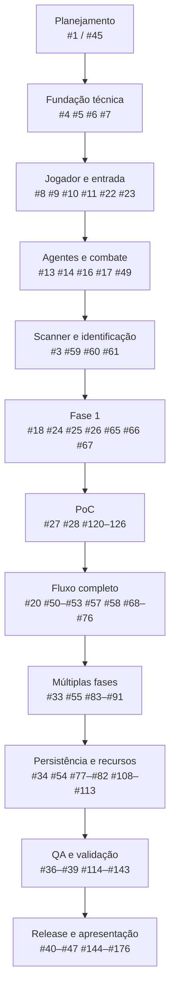
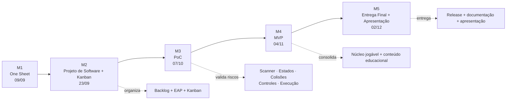

# Nanobô — Sequência operacional das Issues

> **Objetivo:** transformar o backlog do GitHub em um mapa de dependências, validação e marcos, sem substituir o GitHub Project como fonte de verdade do andamento.
>
> **Última auditoria:** 16/09/2026.
>
> **Repositório auditado:** `gustavo-hsilva79/Nanobo`.
>
> **Fontes:** GitHub Issues + estrutura do repositório + documentação atual do projeto + materiais oficiais da disciplina.

---

## 1. Objetivo e autoridade das fontes

Este documento responde principalmente a **“o que depende de quê e por que?”**.

Ele não responde sozinho a **“em que coluna está a Issue?”**. Para isso, use o GitHub Project.

### Hierarquia

1. Requisitos oficiais da disciplina.
2. Decisões registradas no projeto.
3. Estado real do GitHub.
4. Recomendações técnicas.
5. Conhecimento geral.

### Classificação usada

- `[DISCIPLINA]` requisito oficial.
- `[DECISÃO]` escolha já registrada pela dupla.
- `[RECOMENDAÇÃO]` orientação técnica.
- `[PENDÊNCIA]` ainda precisa de decisão ou validação.
- `[OBSERVAÇÃO]` fato encontrado no repositório, Issues ou testes.

---

## 2. Estado atual do backlog

A sequência abaixo não é uma lista de comandos a executar cegamente. Ela organiza dependências e indica quais blocos podem ocorrer em paralelo.

O GitHub Project continua sendo a fonte operacional do andamento.

### Issues recentes que precisam ser consideradas

- **#177 — Definir objetivos de aprendizagem e critérios educacionais**: planejamento educacional; relaciona objetivos observáveis, evidências do scanner, decisões de gameplay e validação do conteúdo.
- **#178 — Implementar feedback visual e educacional das decisões**: feedback após a decisão, explicando a razão biológica da consequência; depende de #18, #31 e #177.
- **#179 — Aprimorar sensação de movimento com aceleração e desaceleração**: melhoria de controle/polimento; não deve bloquear a PoC sem decisão explícita da dupla.

### Issues consolidadas, obsoletas ou duplicadas

Antes de executar uma Issue antiga, confirme seu estado no GitHub. Entre as Issues já identificadas como consolidadas/obsoletas estão #12, #15, #29, #48, #56, #97, #99, #100 e #101.

---

## 3. Modelo de execução

```text
EPIC / FEATURE
      ↓
TASK EXECUTÁVEL
      ↓
TESTE / CRITÉRIO DE ACEITE
      ↓
VALIDAÇÃO NO GITHUB PROJECT
      ↓
PR + REVIEW + MERGE
```

Uma Epic ou Issue-pai não deve ser tratada como concluída apenas porque algumas tarefas internas foram iniciadas. O critério de aceite da própria Issue deve ser verificado.

---

## 4. Visão geral das dependências



**Leitura:** o fluxo representa dependências principais, não uma ordem obrigatoriamente linear. Arte, áudio, documentação e algumas validações podem avançar em paralelo quando suas dependências estiverem satisfeitas.

---

## 5. Etapa 1 — Arquitetura e fundação técnica

### Objetivo
Estabelecer uma base executável e compreensível para o restante do jogo.

### Núcleo

- #1 / #45 — planejamento e organização do projeto.
- #4 — estrutura/base do projeto.
- #5 — inicialização/configuração técnica.
- #6 — Game Loop.
- #7 — máquina de estados.
- #92–#96 — estados do jogo.
- #102 — validação da infraestrutura da máquina de estados.

### Estados previstos

```text
MENU
  ↓
GAME
  ├── PAUSE
  └── GAME OVER
        ↓
      RESULTS
        ↓
     VICTORY
```

`[DECISÃO]` Os estados devem refletir o fluxo realmente definido pela dupla. Se o código atual divergir do documento, registrar a divergência antes de alterar a arquitetura.

---

## 6. Etapa 2 — Entrada, jogador e colisões

### Sequência principal

```text
#8 + #22
   ↓
#9
   ↓
#10
   ↓
#11
```

- #8 / #22 — entrada e controle do jogador.
- #9 — movimento.
- #10 — colisões.
- #11 — vida/dano e resposta às colisões.
- #23 — validações relacionadas aos controles.

### Critério de aceite mínimo

O jogador deve conseguir controlar o Nanobô de forma reproduzível, colidir com elementos relevantes e receber a consequência definida pelo design.

---

## 7. Etapa 3 — Agentes, combate e interação

### Núcleo

- #13 — agentes/organismos.
- #14 — comportamento dos agentes.
- #16 — ataque/projétil.
- #17 — defesa/resistência.
- #49 — integração da mecânica de combate.
- #62–#64 — tarefas associadas ao comportamento/combate.

A mecânica deve permanecer subordinada ao ciclo educacional: informação → decisão → ação → consequência.

---

## 8. Etapa 4 — Scanner e identificação

### Núcleo crítico da PoC

- #3 — scanner.
- #59 — seleção do alvo válido mais próximo.
- #60 — identificação única por agente.
- #61 — integração das informações do scanner.

### Regra funcional já definida

```text
Encontrar alvo válido mais próximo
            ↓
      emitir pulso/camada
            ↓
   obter informação do alvo
            ↓
       identificar
            ↓
 informação orienta a decisão
```

`[DECISÃO]` O scanner trabalha por alvo válido mais próximo, em pulsos/camadas, e a identificação é única por agente.

---

## 9. Etapa 5 — Fase 1 e conteúdo educacional

### Fase 1

- #24–#26 — composição/regras da Fase 1.
- #18 — integração da fase.
- #65–#67 — pontuação/progressão/feedback relacionados à fase.

### Conteúdo educacional

- #177 — objetivos de aprendizagem e critérios educacionais.
- #178 — feedback visual e educacional das decisões.

A Fase 1 deve trabalhar bactérias e células saudáveis, incluindo a distinção entre Gram-positivas e Gram-negativas conforme as decisões já registradas no projeto.

### Fluxo educacional esperado

```text
EXPLORAR
   ↓
ESCANEAR
   ↓
IDENTIFICAR
   ↓
INTERPRETAR A INFORMAÇÃO
   ↓
ESCOLHER A AÇÃO / RAIO
   ↓
CONSEQUÊNCIA
   ↓
FEEDBACK EDUCACIONAL
```

`[PENDÊNCIA]` Qualquer conteúdo biológico ainda não validado deve permanecer explicitamente pendente; não completar lacunas com suposições.

---

## 10. PoC — marco de validação dos maiores riscos

### Issues principais

- #27 — PoC.
- #28 — suporte/estrutura da PoC.
- #120–#126 — validações e testes associados.

### O que a PoC precisa provar

```text
Scanner funcional
      +
Identificação funcional
      +
Decisão baseada na informação
      +
Ação/consequência
      +
Estados e controles utilizáveis
      ↓
Risco técnico/educacional reduzido
```

A PoC não deve ser considerada pronta somente porque o programa compila. Deve existir um teste reproduzível que demonstre os critérios definidos pelas Issues.

### #179

`[RECOMENDAÇÃO]` #179 pode ser feita como melhoria de controle/polimento, mas não deve deslocar os riscos críticos da PoC sem decisão da dupla.

---

## 11. Fluxo completo do jogo

Depois da PoC validada, consolidar o fluxo completo:

- #20 — integração do fluxo.
- #50–#53 — telas/fluxos de interface.
- #57 — resultados/progressão.
- #58 — tutorial/introdução.
- #68–#76 — integração das regras e estados.
- #103–#107 — tarefas relacionadas ao tutorial/fluxo.
- #171–#176 — tarefas relacionadas aos resultados/fluxo final.

### Checklist operacional

```text
[ ] MENU inicia corretamente
[ ] GAME recebe input
[ ] scanner identifica o alvo correto
[ ] decisão usa a informação obtida
[ ] ação produz consequência
[ ] pontuação é atualizada
[ ] PAUSE funciona
[ ] GAME OVER funciona
[ ] RESULTS funciona
[ ] VICTORY funciona
[ ] reinício funciona
```

---

## 12. Múltiplas fases e MVP

### Núcleo

- #33 — estrutura para múltiplas fases.
- #55 — Fase 2: vírus.
- #83–#91 — tarefas da Fase 2.

A Fase 2 deve envolver ciclos lítico/lisogênico e multiplicação limitada conforme as decisões registradas no projeto.

### Dependência importante

`#55` depende da estrutura de múltiplas fases e de uma Fase 1 estável. O critério de aceite precisa demonstrar a Fase 2 jogável de ponta a ponta e a influência do conteúdo educacional nas decisões.

---

## 13. Persistência, recursos e requisitos técnicos

### Persistência

- #34 — hi-score persistente.
- #77–#82 — tarefas de persistência/recursos.
- #54 — recursos do jogo.
- #108–#113 — tarefas associadas.

### Arte e áudio

- #30–#32 — arte, sprites/spritesheet e áudio.

`[DISCIPLINA]` O projeto final precisa contemplar spritesheet, música/SFX e hi-score persistente.

---

## 14. QA, memória e validação externa

### Blocos

- #36–#39 — QA e validação.
- #114–#119 — memória/desempenho.
- #127–#133 — regressão.
- #134–#138 — teste externo.
- #139–#143 — correções críticas.

### Checklist

```text
[ ] Mecânicas
[ ] Controles
[ ] Colisões
[ ] Estados
[ ] Progressão
[ ] Pontuação
[ ] Scanner
[ ] Identificação
[ ] Áudio
[ ] Menu
[ ] Game Over
[ ] Múltiplas fases
[ ] Casos extremos
[ ] Memória <= 100 MB
[ ] Instalação limpa
[ ] Regressão
```

`[DISCIPLINA]` O limite de memória deve ser validado com teste reproduzível, e não presumido a partir do tamanho dos assets ou do executável.

---

## 15. Documentação, release e apresentação

### Documentação

- #40 / #144–#148 — documentação técnica.
- #41 / #149–#153 — One Sheet/GDD e documentação de design.

### Release

- #42 / #154–#158 — preparação da release.
- #43 / #159–#164 — instalador Windows.
- #46 — validação em máquina limpa.

### Apresentação

- #44 / #47 — apresentação.
- #165–#170 — ensaio/validação final.

A documentação final deve descrever o que realmente foi implementado e validado. Resultados não medidos devem ser marcados como `[PENDÊNCIA]`.

---

# 16. Milestones acadêmicos

> **Importante:** os Milestones abaixo são os **marcos oficiais da disciplina**. O número interno do milestone no GitHub não deve ser interpretado automaticamente como o número do marco acadêmico. As Issues precisam ser relacionadas ao marco conforme o trabalho realmente necessário para aquela entrega.



## M1 — One Sheet Paper — 09/09/2026

**Status:** marco histórico.

O One Sheet deveria estar concluído na data oficial. Issues de documentação futura, como #149–#153, não devem ser retroativamente tratadas como pré-requisitos desse marco apenas porque pertencem ao mesmo tema.

## M2 — Projeto de Software + Kanban — 23/09/2026

Issues diretamente relacionadas ao planejamento e organização:

- #1 — planejamento do projeto.
- #45 — Projeto de Software.
- #2 — organização/escopo educacional.
- #177 — objetivos de aprendizagem e critérios educacionais.

**Critério:** a documentação de planejamento, decomposição do trabalho e Kanban deve estar coerente com o estado real do projeto.

`[OBSERVAÇÃO]` A fundação técnica pode avançar em paralelo; não é necessário esperar a data do M2 para programar o projeto, desde que isso não prejudique a entrega do planejamento.

## M3 — PoC — 07/10/2026

A PoC deve priorizar os riscos técnicos e educacionais centrais:

### Fundação

- #4, #5, #6, #7.
- #92–#96.
- #102.

### Jogador e entrada

- #8, #22, #9, #10, #11, #23.

### Agentes e combate

- #13, #14, #16, #17, #49.
- #62–#64.

### Scanner e identificação

- #3.
- #59, #60, #61.

### Fase 1

- #24, #25, #26.
- #65, #66, #67.

### Educação e feedback

- #177.
- #178.

### PoC e validação

- #27, #28.
- #120–#126.

### Não bloqueante por padrão

- #179 — aceleração/desaceleração. Tratar como melhoria/polimento salvo decisão explícita da dupla.

**Critério:** demonstrar de forma reproduzível o ciclo explorar → escanear → identificar → decidir → agir → consequência, com os principais riscos técnicos controlados.

## M4 — MVP — 04/11/2026

O MVP deve consolidar o núcleo jogável e educacional:

- #18, #19, #20.
- #33 — múltiplas fases.
- #55 — Fase 2.
- #57, #58.
- #34, #54.
- #30–#32.
- #50–#53.
- #68–#76.
- #77–#91.
- #103–#113.

**Critério:** fluxo jogável integrado, múltiplas fases conforme o escopo, conteúdo educacional aplicado às decisões, pontuação/progressão e requisitos do MVP funcionando de ponta a ponta.

## M5 — Entrega Final + Apresentação — 02/12/2026

### QA e validação

- #36–#39.
- #114–#119.
- #127–#143.

### Documentação

- #40, #41.
- #144–#153.

### Release/instalação

- #42, #43, #46.
- #154–#164.

### Apresentação

- #44, #47.
- #165–#170.

**Critério:** release final validada, documentação coerente com o produto real, instalador Windows testado, requisitos técnicos verificados e apresentação ensaiada.

---

# 17. Ordem operacional atual

A ordem abaixo é uma referência de execução, não uma fila rígida.

| Ordem | Bloco | Issues principais | Situação esperada |
|---:|---|---|---|
| 01 | Planejamento | #1 / #45 / #2 / #177 | M2 |
| 02 | Fundação | #4 / #5 / #6 / #7 / #92–#96 / #102 | Antes/para PoC |
| 03 | Jogador | #8 / #22 / #9 / #10 / #11 / #23 | Antes/para PoC |
| 04 | Agentes | #13 / #14 / #62–#64 | Para PoC |
| 05 | Combate | #16 / #17 / #49 | Para PoC |
| 06 | Scanner | #3 / #59–#61 | Risco crítico da PoC |
| 07 | Fase 1 | #24–#26 / #65–#67 / #18 | PoC → MVP |
| 08 | Feedback educacional | #178 | PoC → MVP |
| 09 | PoC | #27 / #28 / #120–#126 | M3 |
| 10 | Fluxo integrado | #20 / #50–#53 / #68–#76 | MVP |
| 11 | Tutorial/resultados | #58 / #103–#107 / #57 / #171–#176 | MVP |
| 12 | Múltiplas fases | #33 | MVP |
| 13 | Fase 2 | #55 / #83–#91 | MVP |
| 14 | Persistência/recursos | #34 / #54 / #77–#82 / #108–#113 | MVP → Final |
| 15 | Arte/áudio | #30–#32 | MVP → Final |
| 16 | Memória | #36 / #114–#119 | Final |
| 17 | Regressão | #37 / #127–#133 | Final |
| 18 | Teste externo | #38 / #134–#138 | Final |
| 19 | Correções críticas | #39 / #139–#143 | Final |
| 20 | Documentação | #40 / #41 / #144–#153 | Final |
| 21 | Release | #42 / #43 / #46 / #154–#164 | Final |
| 22 | Apresentação | #44 / #47 / #165–#170 | Final |
| 23 | Polimento opcional | #179 | Conforme capacidade |

---

## 18. O que pode ocorrer em paralelo

```text
                    ┌─ Arte / sprites ────────┐
                    │                           │
Fundação ──┬── Jogador ── Agentes ── Combate ──┼── Fase 1 ── PoC
           │                                   │
           └── Estados ────────────────────────┤
                                               │
Scanner ──────────────────────────────────────┘

Documentação ────────────────┐
QA incremental ──────────────┼── acompanha cada bloco
Áudio ───────────────────────┘
```

A paralelização só é válida quando não cria trabalho bloqueado ou duplicado. Cada integrante deve saber quais arquivos/Issues está alterando para evitar conflitos desnecessários.

---

## 19. Checklist de execução de uma Issue

```text
[ ] Entender objetivo e dependências
[ ] Confirmar critério de aceite
[ ] Verificar se a Issue ainda é válida
[ ] Implementar em branch própria
[ ] Testar cenário principal
[ ] Testar pelo menos um caso extremo
[ ] Registrar resultado
[ ] Abrir/atualizar Pull Request
[ ] Revisar antes do merge
[ ] Atualizar o status no GitHub Project
[ ] Fechar somente após verificar o critério de aceite
```

### Fluxo Git recomendado

```bash
git switch master
git pull

git switch -c feat/nome-da-issue

# implementar e testar
git status
git add .
git commit -m "feat: implementar <objetivo da issue>"
git push -u origin feat/nome-da-issue
```

`[RECOMENDAÇÃO]` O exemplo acima é um fluxo de colaboração. Antes de executar comandos, confirmem a branch atual e o estado local para não sobrescrever trabalho não publicado.

---

# 20. Auditoria de consistência

Antes de considerar este documento como referência de planejamento:

- [x] Milestones acadêmicos separados da numeração interna do GitHub.
- [x] #177, #178 e #179 incluídas.
- [x] #179 não tratada como bloqueador automático da PoC.
- [x] M1 tratado como marco histórico.
- [x] M2 concentrado no Projeto de Software + Kanban.
- [x] M3 concentrado na validação de riscos da PoC.
- [x] M4 concentrado no núcleo do MVP.
- [x] M5 concentrado em QA, release, documentação e apresentação.
- [x] Dependências principais explicitadas.
- [x] Trabalho paralelo explicitado.
- [x] Critérios de validação destacados.
- [x] Issues consolidadas/obsoletas sinalizadas.
- [x] O GitHub Project continua sendo a fonte operacional do status.

### Limite desta sequência

Esta sequência é uma **referência de planejamento**. Ela não substitui a revisão do estado atual das Issues, Pull Requests e Project antes de iniciar cada bloco.

Se uma Issue mudar de escopo, dependência, milestone ou estado, este documento deve ser revisado para manter a coerência.
